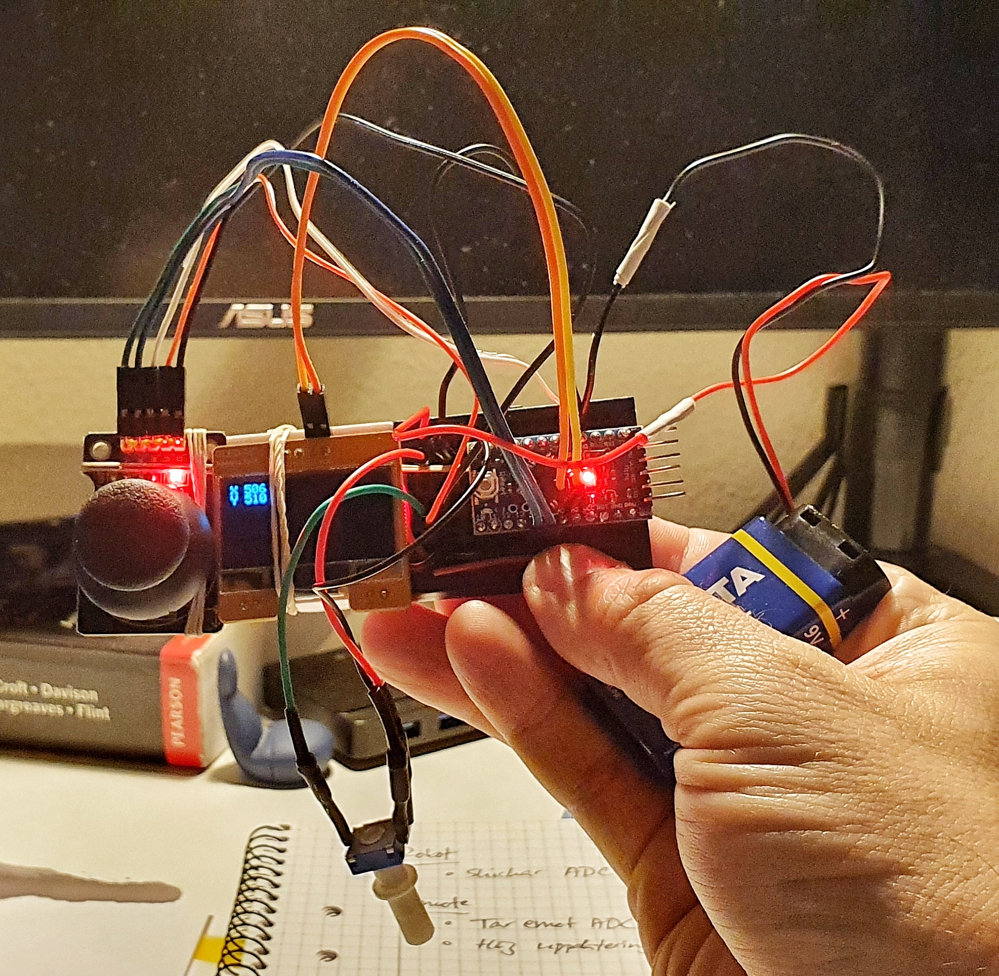

## Remote - With Joystick and OLED Prototype

### Parts included
+ Full size breaboard
+ 1.3" 128x64 I2C OLED display
+ Keyestudio Joystick Module
+ Battery package:
    + 6 x 1.5V AA batteries connected in series (1.5 x 6 = 9V)
+ Arduino Pro Mini 5V (ATmega328P)

## Video Demonstration
[YouTube - Remote controlled Redbot](https://youtu.be/08gzXXrWCw4)

#### 9V ?!
The Arduino Pro Mini 5V supports RAW input of 6V - 16V

### Functionality
+ Receives ADC from robot continiously
+ High update frequency
1. uart_gets()
2. if (PIND & (1 << PIND2)
    + Turn on TXEN0
    + UDR0 = '1';
    + Turn off TXEN0

### Changes needed
+ The functionality of the code in this branch might be interesting to have on the robot since the robot should
  continiously receive PWM data for its motors. 
+ Also, the robot should occationally be able to transmit (if collision or close to a wall)

