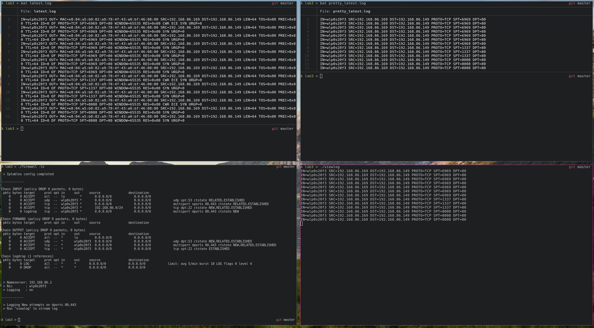

# Firewall
TODO: More verbose README



## Updated method

### Info `firewall`
TODO

#### getopts
+ `-l` logging
+ `-v` verbose
+ `-h` help

#### Logging `-l`
+ Creates a *dummy file* in pwd in the format `YYYY-MM-DD_HH:MM:SS`

### Info `savelog`
+ Gets the date and time from `firewall -l` *dummy file*
+ Passes the date to `journalctl -S` to get logged data from the time `firewall` started
+ Removes the *dummy file*
    + If *dummy file* is needed but not found, `journalctl -S` gets todays date passed to it
+ Logged data > `latest.log`
+ Trimmed version of `latest.log` > `pretty_latest.log`

### Info `viewlog`
+ Continuously prints data since `viewlog`s execution
+ Prettyfied as `pretty_latest.log`

### Info `restore_firewall`
+ Restores `iptables` completely

### Info `curl_test`
+ Locates local IPv4 for `archcrypt.lan` (change this on line *11* and *23*)
+ If not found, starts `nmap` with disabled port scan (host detection only)
+ Once found, `cURL` is run as `sudo` (for usage of portnbr <1000)
    + set `local port` as arg1 and `destination port` as arg2
    + ie `./curl_test 80 443`
+ Tries to download `dummyfile` and save as `fetched_file`


## Old method

### Test Functionality

With cURL:

```sh
# Attacker
sudo curl --local-port 22 http://192.168.86.149:80/filetograb -o filetostore
```

With web server:

```sh
# Victim
sudo python -m http.server 80

# Attacker curl as above
```

### Logging

**View log, follow, filtered on IN and OUT**
```sh
journalctl -f --grep="IN=.*OUT=.*"
```


View log, continuously print new entries (all data)
```sh
journalctl -f
```

View log, filtered
```
journalctl -k --grep="IN=.*OUT=.*"
```


## TODO

* nmap scans
* cleaner Logging in `firewall`


